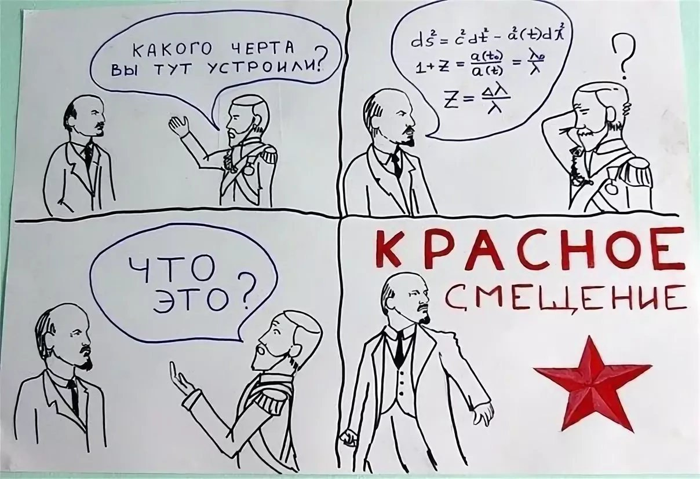

# Домашнее задание № 6

## Случайный лес

В этом задании вам нужно будет реализовать метод случайного леса (random forest).
Научным заданием будет определение красного смещения до галактик по их фотометрическим измерениям.

**Ранний дедлайн 16 мая 23:55**

**Дедлайн 23 мая 23:55**

Вы должны реализовать следующие алгоритмы:

1. Метод решающего дерева для решения задачи регрессии в файле `tree.py`
2. Метод случайного леса (random forest) в файле `forest.py`, используя ваше дерево из `tree.py`

В файле `galaxies.py` загрузите данные `sdss_redshift.csv` с известными красными смещениями (колонка `redshift`) и на данных фотометрии (колонки `u`, `g`, `r`, `i`, `z`) обучите ваш лес:
* Разбейте данные на обучащую и тестовую выборки.
* Сконструируйте такие признаки и подберите гиперпараметры, чтобы достигнуть наименьшего стандартного отклонения предсказания от истинного значения для тестовой выборки.
* Нарисуйте график «истинное значение — предсказание» для всех данных в файл `redhift.png`.
* В файл `redhsift.json` выведите для каждой из выборок стандартное отклонение, в формате
  ```json
  {"train": 0.112, "test": 0.573}
  ```
* Загрузите данные из файла `sdss.csv` с неизвестными красными смещениями и используя обученный лес предскажите значения красных смещений. Результат сохраните в файл `sdss_predict.csv` в том же формате, что и `sdss_redshift.csv`.


**Справка**



Связь красных смещений и фотометрического расстояния см. в [ДЗ 2](https://github.com/pyoadfe/hw2-darkenergy).
Фотометрическое расстояние $d$ связано с зведной величиной $m$, данной вам в таблице как $m \sim 5 \lg(d)$.

Фотометрическое наблюдение — это свертка спектра вашего объекта (то есть распределения энергии его излучения по частотам электро-магнитных волн) с фильтром частот. Таким образом получается поток $F\ \left[\mathrm{эрг}/\mathrm{с}/\mathrm{см}^2\right]$ — величина характеризуемая светимостью объекта и расстоянием до него: $F = \frac{\mathrm{светимость}}{4 \pi d^2}$.
Звездная величина — это логарифм потока: $m \sim -2.5 \lg(F)$, то есть она зависит как от светимости объекта, так и от расстояния до него. Разница звездных величин характерезует цвет объекта.
Подробнее о звездных величинах см [астронет](http://www.astronet.ru/db/msg/1174337)


